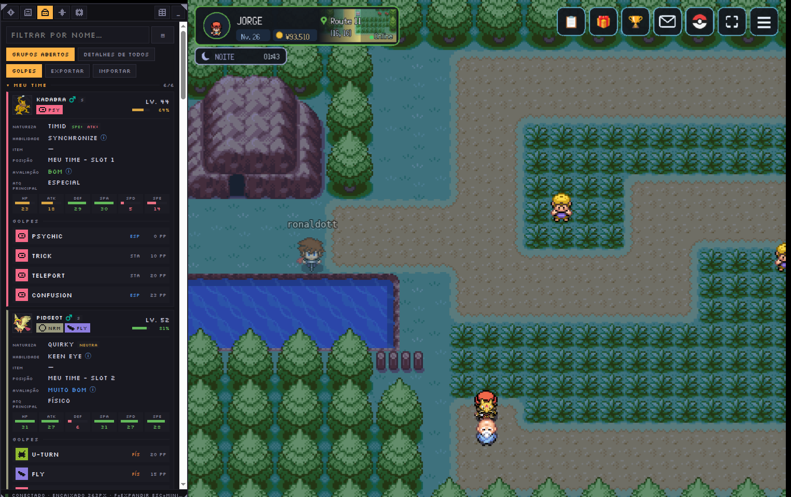
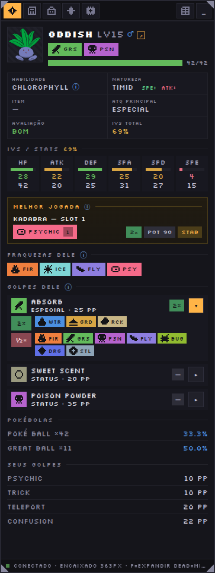
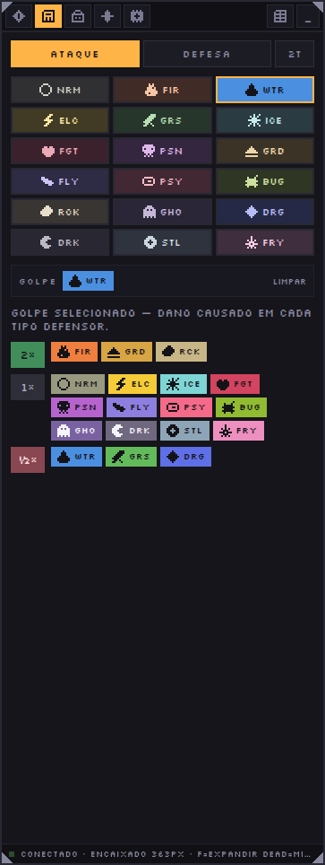
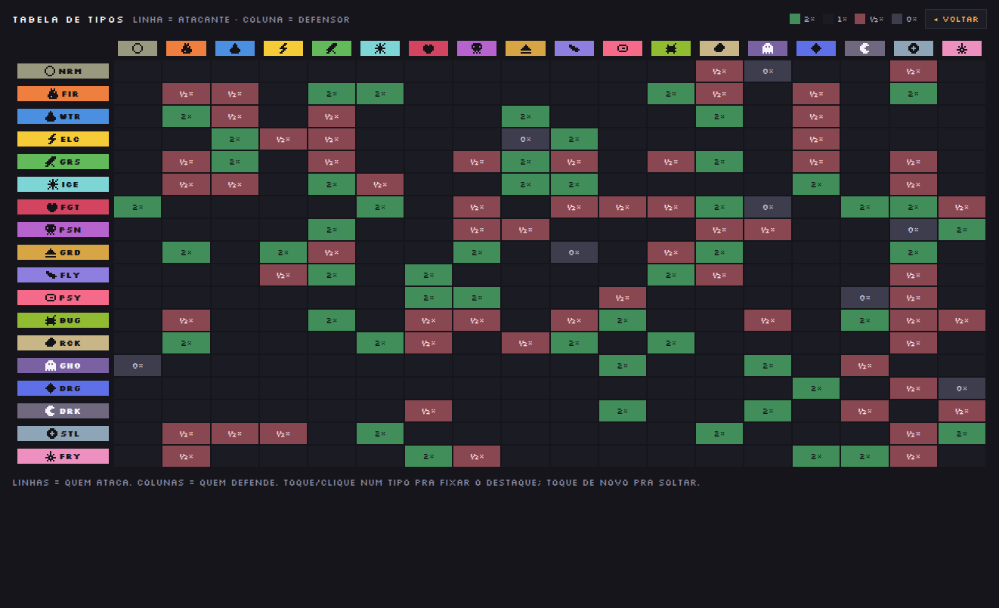
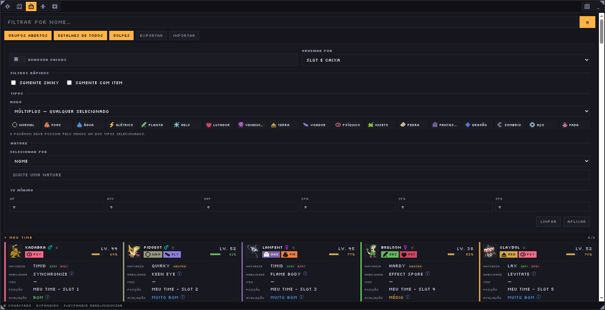
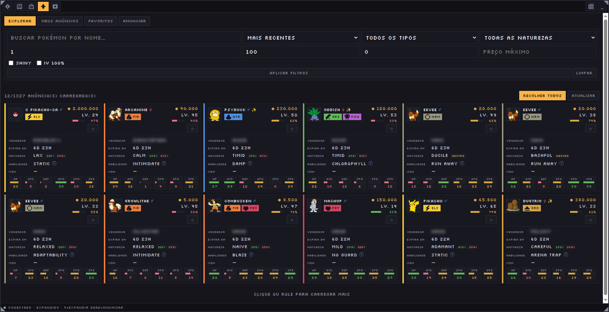
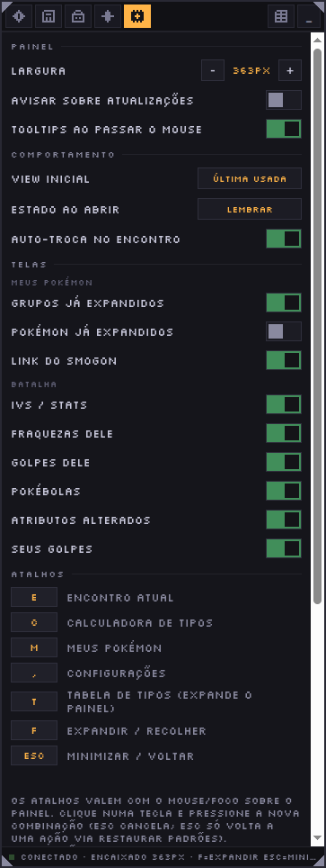
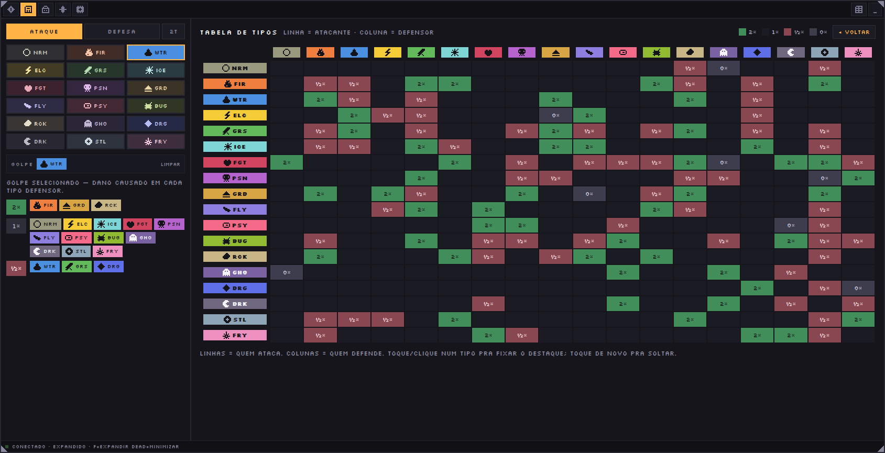

# Infinity MMO Extension

Extensão de navegador (Manifest V3) que adiciona um overlay ao
[infinitymmo.net](https://infinitymmo.net) com dados de batalha ao vivo,
calculadora e tabela de efetividade de tipos, visualização completa do seu
time e do PC, e um painel de configurações para ajustar tudo isso do seu
jeito.



## Sumário

- [Instalação](#instalação)
  - [Opção 1: download do ZIP](#opção-1-download-do-zip)
  - [Opção 2: com Git](#opção-2-com-git)
- [Atualização](#atualização)
- [Primeiros passos](#primeiros-passos)
- [Funcionalidades](#funcionalidades)
  - [Encontro](#encontro)
  - [Calculadora](#calculadora)
  - [Tabela de tipos](#tabela-de-tipos)
  - [Meus Pokémon](#meus-pokémon)
    - [Exportar e importar a lista](#exportar-e-importar-a-lista)
  - [Leilão](#leilão)
- [Configurações](#configurações)
- [Atalhos de teclado](#atalhos-de-teclado)
- [Limitações e observações](#limitações-e-observações)
- [Para desenvolvedores](#para-desenvolvedores)

## Instalação

Existem duas formas de instalar a extensão: baixando os arquivos diretamente
ou clonando o repositório com Git. O download é mais simples; com Git, as
atualizações futuras ficam mais fáceis (veja [Atualização](#atualização)).

### Opção 1: download do ZIP

1. Acesse o [repositório da Infinity MMO Extension](https://github.com/andaraGui/pokemon-infinity-mmo-extension).
2. Escolha a versão desejada no seletor de branch:
   - `main`: versão estável;
   - `develop`: versão beta, com funcionalidades que ainda estão em teste.
3. Clique em **Code → Download ZIP**.
4. Extraia o ZIP em uma pasta que não será apagada ou movida. O navegador
   continuará carregando a extensão a partir dessa pasta.
5. Abra `chrome://extensions` no Chrome ou em outro navegador baseado em
   Chromium.
6. Ative o **Modo do desenvolvedor**.
7. Clique em **Carregar sem compactação** (*Load unpacked*) e selecione a
   pasta extraída que contém o arquivo `manifest.json`.
8. Deixe a extensão ativada.

> Em caso de dúvida nos passos 5-7, a
> [documentação oficial do Chrome](https://developer.chrome.com/docs/extensions/get-started/tutorial/hello-world?hl=pt-br#load-unpacked)
> mostra com capturas de tela como carregar uma extensão sem compactação.

### Opção 2: com Git

Esta opção exige o [Git](https://git-scm.com/) instalado no computador.

1. Abra um terminal na pasta onde deseja guardar a extensão.
2. Clone o repositório:

   ```bash
   git clone https://github.com/andaraGui/pokemon-infinity-mmo-extension.git
   ```

3. Entre na pasta criada:

   ```bash
   cd pokemon-infinity-mmo-extension
   ```

4. Escolha a branch que deseja usar. Para acessar a versão beta:

   ```bash
   git switch develop
   ```

   Para usar a versão estável, permaneça na branch `main` ou execute
   `git switch main`.
5. Abra `chrome://extensions`, ative o **Modo do desenvolvedor**, clique em
   **Carregar sem compactação** e selecione a pasta
   `pokemon-infinity-mmo-extension`, que contém o arquivo `manifest.json`.

## Atualização

**Se instalou pelo ZIP:** baixe novamente o ZIP da branch desejada (`main`
ou `develop`), extraia por cima da pasta já usada e, em `chrome://extensions`,
clique no botão de recarregar (↻) no card da extensão.

**Se instalou com Git:** abra um terminal dentro da pasta do projeto,
confirme que está na branch desejada e baixe as alterações:

```bash
git switch develop # ou: git switch main
git pull
```

Depois de atualizar por qualquer um dos métodos, volte a
`chrome://extensions`, clique no botão de recarregar (↻) no card da extensão
e recarregue a página do jogo. Se a checagem automática de versão estiver
ligada (veja [Configurações](#configurações)), uma faixa de aviso aparece no
overlay quando houver uma versão mais nova disponível na branch escolhida.

## Primeiros passos

1. Clique no ícone da extensão ou use `Ctrl+Shift+Y` para abrir ou fechar o
   overlay inteiro.
2. Fechado/minimizado, o overlay vira uma bolha flutuante com o emoji 🧭 —
   clique nela para reabrir o painel no tamanho salvo.
3. No cabeçalho do painel (arrastável, para reposicionar) ficam os ícones
   das 5 abas — Encontro, Calculadora, Meus Pokémon, Leilão, Configurações —,
   um botão de expandir e o botão de minimizar (`_`).
4. O painel encaixado pode ser redimensionado pelas bordas/cantos, e sua
   posição fica salva entre sessões.
5. O rodapé mostra a barra de status: "CONECTADO" ou "AGUARDANDO DADOS", o
   modo atual (encaixado ou expandido) e os atalhos de expandir/minimizar.
6. O botão de expandir (ou tecla `F`) alterna para o **modo full**, que
   ocupa 90% da largura e da altura da janela — veja detalhes em cada aba,
   em [Funcionalidades](#funcionalidades).
7. O overlay também troca de aba sozinho em alguns momentos: ao começar uma
   batalha (se a "Auto-troca no encontro" estiver ligada) e sempre que o
   personagem sincroniza enquanto você está parado na Calculadora.

## Funcionalidades

### Encontro

Mostrada assim que há um oponente capturado numa batalha.

- Sprite do oponente, nome, nível e símbolo de gênero (♂/♀).
- Badge de **Shiny** (★), quando aplicável.
- Chips com o(s) tipo(s) do oponente.
- Barra de HP, colorida conforme a faixa (verde acima de 50%, âmbar entre
  20% e 50%, vermelho abaixo de 20%).
- Grade de metadados: **Habilidade** (com tooltip de descrição), **Natureza**
  (mostra os atributos que aumenta/diminui, ou "Neutra"), **Item** segurado,
  **Atq principal** (papel ofensivo estimado), **Avaliação** (Ruim / Médio /
  Bom / Muito bom / Excelente) e **IVs total** (percentual dos IVs).
- Seção **IVs/Stats** (ocultável) — os 6 stats com barra de 0 a 31 e valor
  numérico do IV.
- Caixa **MELHOR JOGADA** — aparece só se o Pokémon ainda não foi capturado;
  recomenda a melhor combinação Pokémon + golpe do seu time contra o
  oponente atual, com nome do Pokémon, slot, golpe, badge de multiplicador
  de eficácia (quando diferente de 1×), potência base e badge de STAB.
- Seção **Fraquezas dele** (ocultável) — chips com os tipos que causam dano
  extra no oponente, do maior multiplicador para o menor.
- Seção **Golpes dele** (ocultável) — lista de golpes prováveis do oponente,
  na ordem de confiança: (1) golpes já vistos em batalhas anteriores contra
  o mesmo oponente, (2) moveset exato, quando é batalha de treinador com
  dados correspondentes, (3) estimativa por nível (aprendidos por level-up).
  Cada golpe mostra tipo, categoria, PP, um chip de "pior caso contra seu
  time" e é expansível para a tabela de eficácia desse tipo contra os 18
  tipos; golpes que causam dano se expandem sozinhos na primeira vez que
  aparecem.
- Seção **Pokébolas** (ocultável) — aparece se a captura é permitida e não é
  batalha de treinador; lista cada bola da mochila com quantidade e chance
  de captura calculada.
- Seção **Atributos alterados** (ocultável) — seus e do oponente, mostrando
  só os stats com buff/debuff ativo na batalha atual.
- Seção **Seus golpes** (ocultável) — golpes disponíveis para usar no turno,
  com PP restante; some quando o Pokémon é capturado.
- Badge **GOTCHA** — substitui a seção de golpes quando a captura dá certo.
- Botão **↗** ao lado do nome do oponente — abre a página dele no
  [Smogon](https://www.smogon.com/dex/sm/) em outra aba, na dex da geração
  SM. Serve para checar rapidamente, no meio do encontro, o que aquele
  Pokémon costuma carregar: builds usadas, distribuição de EVs, natures
  recomendadas e o papel competitivo dele. Útil principalmente contra
  espécies que você ainda não conhece, para decidir se vale a pena capturar
  e como treinar depois. Pode ser desligado em Configurações → TELAS →
  BATALHA. O mesmo botão aparece nos cards de
  [Meus Pokémon](#meus-pokémon).



### Calculadora

- **Modo Ataque** (padrão) — seleciona o tipo de **um golpe** (seu ou do
  oponente) e mostra o dano que ele causa em cada tipo defensor (ou
  combinação, com "2T" ligado).
- **Modo Defesa** — seleciona até 2 tipos do **Pokémon defensor** (o mais
  antigo cai ao escolher um 3º) e mostra quais tipos de golpe são mais ou
  menos efetivos contra ele (o 1× neutro fica de fora da lista).
- Botão **2T** (incluir combinações de dois tipos entre os defensores) —
  só habilitado no modo Ataque, já que golpes são sempre de um tipo só.
- Botão **LIMPAR** — zera a seleção de tipos.
- Resultado agrupado por multiplicador (4×, 2×, 1×, ½×, ¼×, 0×), com cores
  invertidas no modo Defesa (verde = bom para quem defende).



### Tabela de tipos

- Acesso: só em **modo full**, ao lado das abas Encontro ou Calculadora, ou
  diretamente pelo atalho `T` a partir de qualquer tela.
- Grade completa 18×18 (linha = tipo atacante, coluna = tipo defensor), com
  legenda de cores (2×, 1×, ½×, 0×).
- Passar o mouse sobre um cabeçalho destaca a linha/coluna; clicar fixa o
  destaque até clicar de novo.
- É uma referência estática de consulta — sem filtros nem controles extras.
- Botão **◂ VOLTAR** — sai do modo full e retorna às abas encaixadas.



### Meus Pokémon

- **Meu time** (até 6) e uma seção por caixa do PC, cada uma colapsável.
- Busca por nome em tempo real (some quando os filtros avançados estão
  ligados, que passam a exigir o botão **Aplicar**).
- Botão de **filtros avançados** (▤) — abre/fecha o painel de filtros.
- Botão **GRUPOS ABERTOS** — expande/recolhe todos os grupos de uma vez.
- Botão **DETALHES DE TODOS** — expande/recolhe os detalhes de todos os
  Pokémon visíveis de uma vez.
- Botão **GOLPES** — mostra/esconde a lista de golpes em todos os cards de
  uma vez. Desligado, o card expandido fica bem mais curto, o que ajuda
  quando o que interessa é comparar IVs e naturezas. Volta ligado quando a
  página é recarregada.
- Botões **EXPORTAR** e **IMPORTAR** — veja
  [Exportar e importar a lista](#exportar-e-importar-a-lista).
- Card de Pokémon (colapsável): sprite, nome, gênero, indicador de shiny
  (✨), botão **↗** do Smogon, chips de tipo, nível e barra de IV total.
  Expandido, mostra natureza, habilidade (com tooltip), item, posição,
  avaliação, atq principal, grade de IVs por stat (com barra colorida por
  atributo) e a lista de golpes conhecidos.
- Botão **↗** — abre aquele Pokémon no
  [Smogon](https://www.smogon.com/dex/sm/) em outra aba. O mesmo botão existe
  na aba Encontro; veja [Encontro](#encontro) para o que ele serve. Pode ser
  desligado em Configurações → TELAS.
- Contador por grupo: "visíveis/total" com filtro ativo, ou
  "ocupados/capacidade" sem filtro.
- Painel de filtros avançados (botões **Limpar** e **Aplicar**):
  - **Remover caixas** — achata a visualização numa lista única.
  - **Ordenar por** — Slot e Caixa, Nível, Alfabética, Tipo, Nature, IV%.
  - **Direção** — Crescente/Decrescente (só para Nível ou IV%).
  - **Filtros rápidos** — Somente Shiny, Somente com item.
  - **Tipos** — modo "Múltiplos" (qualquer tipo selecionado) ou
    "Exclusivos" (todos selecionados, no máximo 2).
  - **Nature** — por Nome (busca com autocomplete e chips) ou por Efeito
    (combos Aumenta/Diminui por stat, ou "Neutras").
  - **IV mínimo** — um campo numérico (0–31) por stat.



#### Exportar e importar a lista

Dá para salvar a sua coleção inteira num arquivo e abrir a coleção de outra
pessoa na mesma tela, com os mesmos filtros, ordenações e detalhes.

- **EXPORTAR** baixa `meus-pokemons-AAAA-MM-DD.json` com o time e **todas** as
  caixas, ignorando os filtros que estiverem ligados. O botão fica desabilitado
  enquanto o personagem não sincroniza.
- **IMPORTAR** abre um desses arquivos. A tela passa a mostrar a lista
  importada e exibe a faixa **LISTA IMPORTADA**, com o botão **VOLTAR AOS
  MEUS**.
- A lista importada existe **só naquela sessão**: ela não é salva, não se
  mistura com os seus Pokémon e some ao recarregar a página. Enquanto ela está
  na tela, os dados do jogo continuam sendo recebidos em segundo plano.
- O arquivo tem só os dados dos Pokémon — nome, nível, gênero, shiny, natureza,
  habilidade, item, tipos, IVs, stats e golpes. Nada de conta, sessão ou
  qualquer outro dado seu.
- Arquivo corrompido ou fora do formato mostra o motivo e mantém a lista que já
  estava na tela.

O formato é este, e a importação também aceita um JSON cru com apenas
`party` e `pc`:

```json
{
  "format": "infinity-mmo-extension/my-pokemons",
  "version": 1,
  "exportedAt": "2026-08-11T02:40:00.000Z",
  "party": [ { "name": "Pikachu", "level": 42 } ],
  "pc": [ { "name": "Caixa 1", "pokemon": [] } ]
}
```

### Leilão

Uma leitura mais confortável do leilão do jogo, com os mesmos cards de Meus
Pokémon. A aba é **passiva**: ela não consulta nada sozinha — espera você abrir
o leilão dentro do jogo e reaproveita essa consulta. Até lá mostra que está
aguardando.

- Quatro modos: **Explorar**, **Meus anúncios**, **Favoritos** e **Anunciar**.
- Busca por nome, ordenação (mais recentes, menor/maior preço, terminando) e
  filtros de tipo, natureza, nível, preço, shiny e IV 100%.
- Carregamento incremental: role a lista para trazer mais anúncios; o contador
  mostra quantos foram carregados do total.
- Cada anúncio mostra preço, vendedor, tempo restante e, ao expandir, natureza,
  habilidade, item e os IVs individuais — os mesmos dados do card de Meus
  Pokémon.
- **Detalhes de todos** expande ou recolhe todos os anúncios de uma vez, e vale
  também para os que chegarem depois pelo scroll.
- Favoritar e desfavoritar acontecem por clique na estrela do card.

Nenhuma compra ou venda acontece sozinha: toda operação continua sendo uma ação
explícita sua, na sua sessão do jogo.



> Os nomes dos vendedores estão borrados nesta imagem de propósito — são
> jogadores reais, e o print vai para um repositório público.

## Configurações

Cinco blocos, nesta ordem na tela.

**PAINEL**
- **Largura** — stepper `-`/`+`, de 250 a 380px em passos de 20px (padrão
  300px). Ajusta a largura do painel encaixado (ou a largura salva para
  quando você sair do modo full).
- **Avisar sobre atualizações** — toggle (padrão desligado). Liga a
  checagem periódica de nova versão e o aviso nas telas.
- **Canal beta** — toggle, só aparece com "Avisar" ligado (padrão
  desligado). Compara a versão instalada contra a branch `develop` em vez
  de `main`.
- **Tooltips ao passar o mouse** — toggle (padrão ligado). Liga/desliga
  globalmente as dicas (ⓘ) em todas as telas.

**COMPORTAMENTO**
- **View inicial** — botão cíclico: Última usada (padrão) / Encontro /
  Calculadora / Meus Pokémon. Define a aba mostrada ao carregar a página,
  quando não sobrescrita pelo foco automático de batalha/personagem.
- **Estado ao abrir** — botão cíclico: Lembrar (padrão) / Minimizado /
  Aberto. Define se o painel começa como bolha minimizada ou aberto.
- **Auto-troca no encontro** — toggle (padrão ligado). Troca
  automaticamente para a aba Encontro quando uma batalha começa. Não afeta
  a troca (sempre ativa) para Meus Pokémon quando o personagem sincroniza.

**TELAS**

*Meus Pokémon:*
- **Grupos já expandidos** (padrão ligado) — grupos nascem expandidos ao
  carregar dados novos.
- **Pokémon já expandidos** (padrão desligado) — cards nascem com os
  detalhes abertos na primeira carga da tela (toggles manuais depois têm
  prioridade).
- **Link do Smogon** (padrão ligado) — mostra o botão **↗** no card, que abre
  o Pokémon no Smogon em outra aba. A mudança vale na hora, sem recarregar.

*Batalha* (todos ligados por padrão) — mostram/ocultam seções da aba
Encontro:
- **IVs / Stats**
- **Fraquezas dele**
- **Golpes dele**
- **Pokébolas**
- **Atributos alterados**
- **Seus golpes**
- **Link do Smogon** — o botão **↗** ao lado do nome do oponente

**ATALHOS**
- Um botão por ação, mostrando a combinação atual. Clicar entra em modo de
  captura (`...`) — a próxima tecla pressionada vira a nova combinação,
  salva automaticamente. `Esc` cancela a captura sem salvar; clicar fora
  também cancela. Uma combinação já usada por outra ação é recusada, com
  aviso indicando qual ação é a dona dela.
- **Restaurar atalhos padrão** — devolve as 7 ações aos valores de fábrica.
- **Configurar atalho do navegador** — abre `chrome://extensions/shortcuts`
  (Chrome) ou `about:addons` (Firefox), onde o atalho global
  `Ctrl+Shift+Y` pode ser remapeado.

**DADOS**
- **Exportar configurações** — baixa `pokemon-helper-config.json` com suas
  preferências de painel, comportamento, telas, atalhos e avisos de
  atualização. Nunca inclui pokédex, habilidades ou golpes descobertos.
- **Importar configurações** — abre um seletor de arquivo `.json`, valida o
  formato e copia só os campos conhecidos; um arquivo inválido não altera
  nada.
- **Restaurar tudo** — pede confirmação e devolve todas as configurações
  (painel, comportamento, telas, atalhos) aos padrões de fábrica.





## Atalhos de teclado

Os 7 atalhos internos são remapeáveis em
[Configurações → ATALHOS](#configurações) e só funcionam com o mouse/foco
sobre o painel do overlay (nunca disparam na página do jogo).

| Ação | Atalho padrão | Onde funciona |
|---|---|---|
| Abrir/fechar o overlay inteiro | `Ctrl+Shift+Y` | Atalho do navegador (`chrome://extensions/shortcuts`) |
| Encontro | `1` | Com foco no painel |
| Calculadora | `2` | Com foco no painel |
| Meus Pokémon | `3` | Com foco no painel |
| Configurações | `4` | Com foco no painel |
| Tabela de tipos | `5` | Com foco no painel |
| Expandir/recolher (modo full) | `F` | Com foco no painel |
| Minimizar/voltar | `Esc` | Com foco no painel |

## Limitações e observações

- Boa parte dos dados (encontro, time, PC) só aparece depois que o jogo
  envia a sincronização correspondente — antes disso o overlay mostra
  "Nenhum encontro capturado ainda" ou "Aguardando os dados dos
  Pokémon...".
- Combinações reservadas pelo próprio navegador (ex.: `Ctrl+W`, `Ctrl+T`)
  podem não chegar até a extensão, mesmo remapeadas.
- `Esc` só pode voltar a ser um atalho pelo botão "Restaurar atalhos
  padrão" — cancelar uma captura com `Esc` nunca o atribui a uma ação.
- Os golpes listados em "Golpes dele" nem sempre são o moveset real: fora
  de batalhas de treinador (ou sem dados de treinador correspondentes), a
  lista é uma estimativa heurística por nível; a origem de cada lista
  aparece no tooltip (ⓘ) da seção.
- A "Melhor jogada" e o "pior caso" contra seu time são estimativas de
  cálculo (potência × precisão × eficácia × STAB × ataque) — não uma
  garantia de resultado no jogo, já que não consideram habilidades, itens
  ou clima.
- A tabela de tipos é uma referência estática (com destaque ao passar o
  mouse), sem filtros — diferente da Calculadora, que tem seleção e modos.
- A extensão não envia dados para servidores externos, além de checagens
  de atualização e download de dados públicos da wiki do jogo.

## Para desenvolvedores

Quer contribuir com código, entender a arquitetura do overlay ou debugar a
extensão com o DevTools? Toda essa documentação técnica vive em
[docs/DEVELOPMENT.md](docs/DEVELOPMENT.md).
